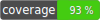

## Get laravel eloquent relations using reflection.

[](https://github.com/panakour/laravel-eloquent-relationships/actions/workflows/tests.yml)

[](https://packagist.org/packages/panakour/laravel-eloquent-relationships)

### This will let you programmatically get the relations of models in laravel to use them how you want.

## Examples

```php
use EloquentRelationships\RelationMethods;
use EloquentRelationships\Relations;

$relations = new Relations(new YourModel());

//get all relations
$collection = $relations->all();

//or get relations by method

//belongsToMany
$collection = $relations->getByMethod(RelationMethods::BelongsToMany->value);

//MorphedByMany
$collection = $relations->getByMethod(RelationMethods::MorphedByMany->value);
```
